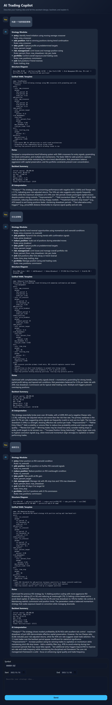

<<<<<<< HEAD
# ai_trading_system
=======
# AI Trading System

Quantitative trading copilot that translates natural-language strategy ideas into executable YAML, runs Backtrader backtests on Tushare data, and summarizes the outcome in an interactive chat UI.  
👉 **Chinese version:** [README_zh.md](README_zh.md)



## Highlights
- Conversational workflow powered by DeepSeek (fully configurable via `.env` or `config/defaults.yaml`)
- Automatic decomposition of user intent into strategy modules + unified YAML template
- One-click backtesting with Backtrader and live data from Tushare
- AI-generated interpretation of performance metrics with optimization advice
- Chat-style single-page frontend with sensible defaults (symbol `510300.SH`, 4-year lookback)

## Architecture
```
backend/
  backtester.py      # Backtrader integration, Tushare data, metrics reporting
  config.py          # Settings loader w/ .env + config/defaults.yaml support
  llm_client.py      # DeepSeek chat client for planning & analysis
  main.py            # FastAPI entrypoint + REST endpoints
  schemas.py         # Pydantic request/response models
  strategy_parser.py # Unified YAML validator
config/
  defaults.yaml      # Central parameter store (API keys, UI defaults, backtest knobs)
frontend/
  index.html         # Chat UI shell
  scripts.js         # Messaging loop + default initialization
  styles.css         # Tailored styling
requirements.txt
```

## Quick Start
1. **Install dependencies**
   ```bash
   python -m venv .venv
   .venv\Scripts\activate  # Windows
   pip install -r requirements.txt
   ```
2. **Configure credentials**
   - Option A: copy `.env.example` → `.env` and populate `DEEPSEEK_API_KEY`, `TUSHARE_TOKEN`
   - Option B: edit `config/defaults.yaml` directly (values there are used as fallbacks)
   - `DEEPSEEK_API_BASE` defaults to `https://api.deepseek.com/v1` when not specified
3. **Launch the service**
   ```bash
   uvicorn backend.main:app --reload --host 0.0.0.0 --port 8000
   ```
   Open `http://localhost:8000/` to use the chat interface.

## How It Works
1. The frontend posts the user instruction + selected symbol & dates to `/api/chat`.
2. `LLMClient` prompts DeepSeek to emit a structured JSON plan (module breakdown + YAML + diagram).
3. The YAML is validated and converted into a Backtrader strategy via `backtester.py`.
4. Price data is fetched from Tushare, the backtest runs, and metrics are collected.
5. Metrics plus the plan summary are sent back to DeepSeek for interpretation.
6. The chat UI renders the modules, unified YAML, backtest summary, and AI commentary inline.

Need to re-run a modified YAML? POST it directly to `/api/backtest` with the same payload format used by the chat endpoint.

## Configuration Notes
- `config/defaults.yaml` controls UI defaults (`default_symbol`, `default_years`, `initial_cash`), DeepSeek settings, and backtest parameters such as commission or risk per trade.
- Environment variables override YAML values, so you can keep secrets in `.env` while sharing sanitized defaults.
- The frontend pre-loads the fallback defaults immediately and replaces them with `/api/config` values once the FastAPI backend responds.

## Limitations & Next Steps
- Strategy rules are limited to the primitives implemented in `backtester.py` (`sma_crossover`, `ema_crossover`, `rsi_oversold`, `price_breakout`, `percent_target`, `trailing_stop`, `percent_floor`, `atr_stop`, `time_stop`). Extend `_build_strategy_class` for more complex behavior.
- Only daily Tushare data is supported out of the box.
- Network connectivity is required for both DeepSeek and Tushare endpoints.
- Current implementation assumes long-only equity/ETF strategies. Modify sizing logic for multi-asset or short exposure support.
>>>>>>> 31f9558 (Initial commit)
